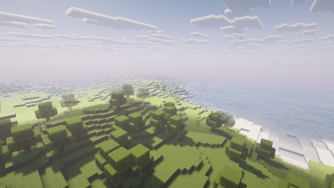
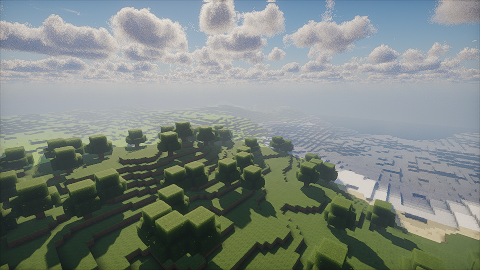
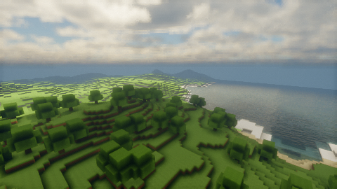
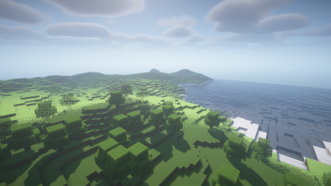
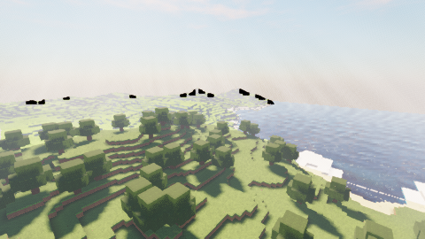
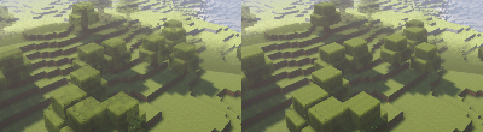

# Validation results

Everything here was run on **2026-10-05** on the final tree of this pass (base commit `f78b387`
plus this pass's uncommitted changes: `README.md`, this file, and a one-line locking fix in
`UniformEvaluator.java` that the Java build below already covers; the Rust code is identical to
the tree the Rust suites ran on), on a machine **without a GPU and without a
display**:

* Rust 1.97.0, `CARGO_INCREMENTAL=0`; debug builds for the test suites, release builds
  (`CARGO_TARGET_DIR=/dev/shm/sb-cargo-target`) for the command-line runs.
* Vulkan: Mesa lavapipe 25.2.8 (LLVM 20.1.2, CPU), Vulkan 1.4, with the Khronos validation
  layer (including synchronization validation) wherever the runtime renders.
* Java: OpenJDK 25.0.4.1, Gradle with Fabric Loom; Minecraft 26.3 (Loom's merged deobfuscated
  jar), Fabric API 0.161.0+26.3, Distant Horizons 3.3.4, Sodium 0.9.3-alpha.1.

**Minecraft itself never ran.** Every result about the Fabric mod comes from compilation,
bytecode checks against the game and mod jars, unit tests and a JNI smoke test; see
[What is compile-verified only](#what-is-compile-verified-only).

## Summary

| Check | Command | Result |
|---|---|---|
| Rust tests | `cargo test --workspace --no-fail-fast` | **912 passed, 0 failed, 2 ignored** (54 test binaries incl. doctests, 1,039 s) |
| Clippy | `cargo clippy --workspace --all-targets -- -D warnings` | clean; also clean with `-p sb-runtime --all-targets --features pipeline-tests` |
| Rustdoc | `RUSTDOCFLAGS="-D warnings" cargo doc --workspace --no-deps` | clean (11 crates) |
| Translator corpus matrix | `sb-transform` test `corpus` | 100% of program stages compile and pass `spirv-val` in every row ([below](#transform-matrix)) |
| Corpus validate, small | `shaderbridge validate corpus/*` | **12/12 packs**, 1,020 programs, 2,000/2,000 SPIR-V modules valid, 22 s |
| Corpus validate, extended | `shaderbridge validate corpus2/*` | **43/43 packs**, 4,621 programs, 9,141/9,141 SPIR-V modules valid, 98 s |
| Runtime pack suite | `cargo test -p sb-runtime --features pipeline-tests --test corpus_packs -- --ignored` | **7 passed, 0 failed** (625 s): 52 corpus entries render with 0 validation errors; depth parity and the 3 named renders pass |
| Renders | `shaderbridge render <pack> --width 480 --height 270 --frames 30` | 6 packs, **0 validation errors, 0 validation warnings** each ([below](#renders)) |
| Java build and JUnit | `./gradlew build` (native library included, `SB_CORPUS_DIR` set) | **BUILD SUCCESSFUL**: 507 JUnit tests in 110 classes and 4 native tests, 0 failures, 0 skipped (81 s) |

## Corpora

The packs are third-party and not part of the repository. The tests look for them through
environment variables and skip (with a message) when they are missing. Without the variables
they fall back to a git-ignored `test-data/` directory at the repository root (`test-data/corpus`,
`test-data/corpus2`, and `test-data/mc/x_iris/META-INF/jars/jcpp-1.4.14.jar` for the JCPP oracle),
which can be a symlink to wherever the corpora live:

| Variable | Used by |
|---|---|
| `SB_CORPUS_DIR` (one root, the small corpus) | `sb-preprocess`, `sb-pack`, `sb-compile`, `sb-expr`, `sb-uniforms` corpus tests; the Java `NativeCorpusSmokeTest` (also `-Pshaderbridge.corpus`) |
| `SB_CORPUS2_DIR` (the extended corpus) | the second half of the `sb-expr` corpus test |
| `SB_CORPUS_DIRS` (colon-separated roots) | `sb-transform`, `sb-pipeline` and `sb-runtime` corpus tests |
| `SB_JCPP_JAR` | the JCPP differential test of `sb-preprocess` (Iris's preprocessor as the oracle) |

* **Small corpus** (`corpus/`): 12 packs from git checkouts: 8 packs plus the 4 tutorial packs
  of MinecraftShaderProgramming (its *Tutorial 0* has no shaders). `corpus/optifine` (the
  OptiFine documentation repository) holds no pack and is skipped by `validate` with a warning.
* **Extended corpus** (`corpus2/`): 43 packs downloaded from Modrinth (the newest version of
  each when the corpus was assembled, preferring versions published for the Iris loader; version
  and publication date in the table below).

## Rust tests

`cargo test --workspace --no-fail-fast` (debug, lavapipe). GPU tests ran on lavapipe and none was
skipped. The 2 ignored tests are ignored by design: `sb-pipeline`'s `session_recompile_timing`
(a benchmark) and `sb-transform`'s `dump` (a debugging aid).

| crate | passed | failed | ignored | test binaries |
|---|---|---|---|---|
| sb-cli | 5 | 0 | 0 | lib 1, cli 4 |
| sb-compile | 120 | 0 | 0 | lib 60, compile 28, corpus 3, reflect 21, validate 7, doc 1 |
| sb-core | 19 | 0 | 0 | lib 18, doc 1 |
| sb-expr | 75 | 0 | 0 | lib 62, corpus 4, no_alloc 1, robustness 5, doc 3 |
| sb-jni | 14 | 0 | 0 | lib 14 |
| sb-pack | 122 | 0 | 0 | lib 99, corpus 10, java_properties_oracle 1, robustness 3, zip_vfs 8, doc 1 |
| sb-pipeline | 61 | 0 | 1 | lib 59, corpus 1 (small corpus, 70 s), doc 1 |
| sb-preprocess | 133 | 0 | 0 | lib 110, corpus 6, glslang_differential 1, jcpp_differential 3, reserved_words 6, robustness 4, doc 3 |
| sb-runtime | 98 | 0 | 0 | lib 77, feature_coverage 1, minimal_pack 8, profile_layouts 2, review_regressions 7, robustness 1, sodium_terrain 1, doc 1 |
| sb-transform | 189 | 0 | 1 | lib 34, basic 2, corpus 1 (both corpora, 726 s), rules 146, sodium_profile 5, doc 1 |
| sb-uniforms | 76 | 0 | 0 | lib 59, corpus 5, glslang_layout 3, spec_registry 5, doc 4 |
| **total** | **912** | **0** | **2** | 54 |

Notable tests added in this pass: per-slot blend and alpha defaults
(`sb-core` `slots_resolve_blend_and_alpha_reference`, `alpha_tests_are_per_slot`;
`sb-pipeline` `slots_carry_iris_blend_and_alpha_defaults`), bounded session caches over 8
recompiles (`session_caches_stay_bounded_across_recompiles`), diagnostics at moved lines
(`session_reports_moved_lines`, which fails without the fix), variant diagnostics
(`compile_variant_returns_its_diagnostics`), Iris-style truncation of relative sizes,
`backFace.*` ignored like Iris 26.3 (`back_face_settings_are_ignored_like_iris`), Sodium's texture
coordinate encoding (`sodium_vertex_byte_layout`) and the DH `gtexture` note
(`binding.class-resource`).

## Transform matrix

`sb-transform`'s `corpus` test translates every enabled program of every dimension folder of both
corpora (54 packs, 185 program folders) and compiles each stage with glslang and `spirv-val`, for
the packs' default options and for "max" options (every boolean option on, every value option at
its last listed value), with four translation variants: forward-Z, reversed-Z, the Renderpearl
target (Mojang's pipeline builder) and synthesized Distant Horizons programs. The max set runs the
forward and reversed variants. Stage interfaces are also checked against each other (locations,
types, flatness).

| options | variant | corpus | stages compile | rate | root + world0 | other folders | known pack bugs |
|---|---|---|---|---|---|---|---|
| defaults | Forward | extended | 7765/7765 | 100.00 % | 2714/2714 | 5051/5051 | 0 |
| defaults | Forward | small | 1370/1370 | 100.00 % | 572/572 | 798/798 | 0 |
| defaults | Reversed | extended | 7765/7765 | 100.00 % | 2714/2714 | 5051/5051 | 0 |
| defaults | Reversed | small | 1370/1370 | 100.00 % | 572/572 | 798/798 | 0 |
| defaults | Renderpearl | extended | 7765/7765 | 100.00 % | 2714/2714 | 5051/5051 | 0 |
| defaults | Renderpearl | small | 1370/1370 | 100.00 % | 572/572 | 798/798 | 0 |
| defaults | DhSynth | extended | 466/466 | 100.00 % | 158/158 | 308/308 | 0 |
| defaults | DhSynth | small | 58/58 | 100.00 % | 26/26 | 32/32 | 0 |
| max | Forward | extended | 8058/8058 | 100.00 % | 2821/2841 | 5237/5296 | 79 |
| max | Forward | small | 1441/1441 | 100.00 % | 601/605 | 840/844 | 8 |
| max | Reversed | extended | 8058/8058 | 100.00 % | 2821/2841 | 5237/5296 | 79 |
| max | Reversed | small | 1441/1441 | 100.00 % | 601/605 | 840/844 | 8 |

The rate excludes **known pack bugs**: 174 stage compiles (87 per max variant) that fail because
of errors in the packs' own code once every option is switched on, each recorded with its reason
in `KNOWN_PACK_BUGS` of `crates/sb-transform/tests/corpus.rs`. Examples: with
`WATER_ALPHA_MULT > 100` Complementary's `water.glsl` writes `translucentMult`, which its
`dh_water` never declares; spectrum reads `skylightPosY`, which it never defines; Arc's
`AF_ENABLED` calls `textureAnisotropic` from programs that do not include it; shrimple's
`DYN_LIGHT_DEBUG_COUNTS` writes to a buffer it declares `readonly`; vanilla-plus uses an undefined
`sRGB_P3D65`. No default-option compile fails.

## Corpus validate

The release CLI compiles every pack completely (both output targets, every dimension folder, DH
strategy per folder) and runs `spirv-val` on every SPIR-V module: `shaderbridge validate corpus/*`
and `shaderbridge validate corpus2/*`, both exit code 0.

#### Small corpus (`corpus/*`, git checkouts)

| pack | source | result | programs ok | failed | SPIR-V modules (all pass spirv-val) | dimensions / DH strategy |
|---|---|---|---|---|---|---|
| Bliss-Shader | X0nk/Bliss-Shader @81e403e | PASS | 119 | 0 | 238 / 238 | world0:native world-1:native world1:native |
| ComplementaryReimagined | ComplementaryDevelopment/ComplementaryReimagined @c09950d | PASS | 108 | 0 | 216 / 216 | world0:native world-1:native world1:native |
| Tutorial 1 - Final Shader Program | saada2006/MinecraftShaderProgramming @4cb58a9 | PASS | 31 | 0 | 62 / 62 | (root):synthesized |
| Tutorial 2 - Composite and GBuffers | saada2006/MinecraftShaderProgramming @4cb58a9 | PASS | 26 | 0 | 52 / 52 | (root):synthesized |
| Tutorial 3 - Advanced Lighting | saada2006/MinecraftShaderProgramming @4cb58a9 | PASS | 29 | 0 | 58 / 58 | (root):synthesized |
| Tutorial 4 - Advanced Shadow Mapping | saada2006/MinecraftShaderProgramming @4cb58a9 | PASS | 29 | 0 | 58 / 58 | (root):synthesized |
| Ominous-Shaderpack | XorDev/Ominous-Shaderpack @b1e9b14 | PASS | 23 | 0 | 46 / 46 | (root):synthesized |
| RethinkingVoxels | gri573/rethinking-voxels @1fd788f | PASS | 156 | 0 | 288 / 288 | world0:synthesized world-1:synthesized world1:synthesized |
| Super-Duper-Vanilla | Eldeston/Super-Duper-Vanilla @1ca20aa | PASS | 120 | 0 | 240 / 240 | world0:native world-1:native world1:native |
| glimmer-shaders | jbritain/glimmer-shaders @6a59109 | PASS | 141 | 0 | 270 / 270 | world0:native world-1:native world1:native |
| photon | sixthsurge/photon @15458c0 | PASS | 178 | 0 | 355 / 355 | world0:native world-1:native world1:native |
| spectrum | zombye/spectrum @a1328f0 | PASS | 60 | 0 | 117 / 117 | world0:synthesized |

#### Extended corpus (`corpus2/*`, Modrinth releases)

| pack | version (Modrinth) | result | programs ok | failed | SPIR-V modules (all pass spirv-val) | dimensions / DH strategy |
|---|---|---|---|---|---|---|
| arc-shader | 0.15.2 (2023-03-01) | PASS | 100 | 0 | 202 / 202 | (root):synthesized world-1:synthesized world1:synthesized |
| astralex | 93.0 (2024-06-16) | PASS | 107 | 0 | 214 / 214 | world0:synthesized world-1:synthesized world1:synthesized |
| bliss-shader | 2.1.2 (2025-11-23) | PASS | 119 | 0 | 238 / 238 | world0:native world-1:native world1:native |
| bloop-shaders | 1.8.0-Alpha-3 (2026-03-25) | PASS | 116 | 0 | 232 / 232 | world-1:native world1:native world0:native |
| bsl-shaders | 10.1.8 (2026-09-21) | PASS | 96 | 0 | 192 / 192 | world0:native world-1:native world1:native |
| bsl-shaders-classic | 10.0 (2025-05-10) | PASS | 93 | 0 | 186 / 186 | world0:native world-1:native world1:native |
| complementary-reimagined | r5.9.3 (2026-09-15) | PASS | 108 | 0 | 216 / 216 | world0:native world-1:native world1:native |
| complementary-unbound | r5.9.3 (2026-09-15) | PASS | 108 | 0 | 216 / 216 | world0:native world-1:native world1:native |
| daybreak-shader | 0.2 (2024-06-26) | PASS | 13 | 0 | 26 / 26 | (root):native |
| ebin-resurrected | 1.5.6 (2025-05-25) | PASS | 84 | 0 | 165 / 165 | world0:synthesized world-1:synthesized world1:synthesized |
| fastpbr | 2.0 (2025-02-28) | PASS | 141 | 0 | 264 / 264 | world0:native world-1:native world1:native |
| glimmer-shaders | 1.5.2 (2026-02-24) | PASS | 141 | 0 | 270 / 270 | world0:native world-1:native world1:native |
| hysteria-shaders | 1.2.1 (2024-08-02) | PASS | 143 | 0 | 286 / 286 | world0:native world-1:native world1:native |
| i-like-vanilla | v1.5.0 (2026-09-26) | PASS | 115 | 0 | 230 / 230 | world0:native world-1:native world1:native |
| insanity-shader | 1.650 (2024-06-13) | PASS | 87 | 0 | 174 / 174 | world0:synthesized world-1:synthesized world1:synthesized |
| kappa-shader | 5.3 (2025-02-28) | PASS | 158 | 0 | 316 / 316 | world0:synthesized world-1:synthesized world1:synthesized |
| kuda-shaders | 6.5.26 (2026-04-02) | PASS | 71 | 0 | 142 / 142 | (root):synthesized world-1:synthesized world1:synthesized |
| light-shaders | 1.8.0 (2026-08-23) | PASS | 61 | 0 | 122 / 122 | (root):synthesized world-1:synthesized world1:synthesized |
| lite-shaders | ELT512 (2026-09-27) | PASS | 118 | 0 | 236 / 236 | (root):synthesized world0:native world-1:native world1:native |
| lux-v1 | 1.3 (2026-09-26) | PASS | 86 | 0 | 172 / 172 | world0:synthesized world-1:synthesized world1:synthesized |
| makeup-ultra-fast-shaders | 9.5f (2026-09-27) | PASS | 122 | 0 | 244 / 244 | (root):synthesized world0:native world-1:native world1:native |
| mellow | 3.4.1a (2026-09-22) | PASS | 124 | 0 | 248 / 248 | world0:native world-1:native world1:native world_modded:native |
| miniature-shader | 2.19 (2026-07-29) | PASS | 72 | 0 | 144 / 144 | world0:synthesized world-1:synthesized world1:synthesized |
| noble | 1.9.9 (2026-09-28) | PASS | 189 | 0 | 370 / 370 | world0:native world-1:native world1:native |
| nostalgia-shader | 5.1 (2025-02-28) | PASS | 149 | 0 | 298 / 298 | world0:synthesized world-1:synthesized world1:synthesized |
| pastel-shaders | 1.200 (2024-06-13) | PASS | 90 | 0 | 180 / 180 | world0:synthesized world-1:synthesized world1:synthesized |
| photon-shader | v1.3b (2026-04-14) | PASS | 160 | 0 | 319 / 319 | world0:native world-1:native world1:native |
| potato-shaders | 1.0d (2023-06-13) | PASS | 84 | 0 | 168 / 168 | world0:synthesized world-1:synthesized world1:synthesized |
| redhat-shaders | 34.3.1 (2026-04-30) | PASS | 68 | 0 | 136 / 136 | (root):synthesized world-1:synthesized world1:synthesized |
| renderpearl | 2.8.0-beta.4 (2026-07-21) | PASS | 129 | 0 | 234 / 234 | world_nether:native world_end:native world_default:native |
| rethinking-voxels | r0.1-beta9 (2025-06-19) | PASS | 139 | 0 | 253 / 253 | world0:native world-1:native world1:native |
| shrimple | v0.12 (2024-12-08) | PASS | 206 | 0 | 403 / 403 | world0:native world-1:native world1:native |
| sildurs-enhanced-default-shaders | 1.20 (2026-09-15) | PASS | 46 | 0 | 92 / 92 | (root):native world-1:native world1:native |
| sildurs-vibrant-shaders | 2.02 (2026-09-15) | PASS | 78 | 0 | 156 / 156 | (root):native world-1:native world1:native |
| soft-voxels-lite | 2.0 (2023-06-12) | PASS | 113 | 0 | 232 / 232 | world0:synthesized world-1:synthesized |
| solas-shader | 3.7b (2026-08-23) | PASS | 92 | 0 | 181 / 181 | (root):native world-1:native world1:native |
| spooklementary | v2.0.4 (2025-12-05) | PASS | 102 | 0 | 204 / 204 | world0:native world-1:native world1:native |
| sundial-lite | 1.2.0 (2026-09-26) | PASS | 127 | 0 | 254 / 254 | (root):native world-1:native world1:native |
| super-duper-vanilla | 1.3.8 (2025-07-08) | PASS | 120 | 0 | 240 / 240 | world0:native world-1:native world1:native |
| vanilla-plus-shader | 3.3 (2025-02-28) | PASS | 98 | 0 | 196 / 196 | world0:synthesized world-1:synthesized world1:synthesized |
| vanillaa | 1.3 (2023-08-31) | PASS | 14 | 0 | 28 / 28 | (root):synthesized |
| visual-vibrance | 0.3.5a (2026-02-01) | PASS | 125 | 0 | 244 / 244 | world0:native world-1:native world1:native |
| voyager-shader-2.0 | 2.0.8 (2024-05-23) | PASS | 109 | 0 | 218 / 218 | world0:synthesized world-1:synthesized world1:synthesized |

## Renders

`shaderbridge render <pack> -o <png> --width 480 --height 270 --frames 30` (world0, forward depth,
lavapipe, Khronos validation with synchronization validation). The scene is `sb-runtime`'s
synthetic world: procedural terrain with trees and water, a few entities, sky, sun and moon, and
Distant Horizons LOD terrain; it is not Minecraft. Five of the six images are copied to
[docs/images](images), with a close-up of the leaf change described below.

| pack | DH | passes / draws / dispatches (30 frames) | validation | verdict |
|---|---|---|---|---|
| Complementary Reimagined (`corpus`) | native | 12 / 533 / 0 | 0 errors, 0 warnings | Plausible: lit terrain with shadows, opaque cutout leaves, water, fog, clouds. |
| Photon (`corpus`) | native | 30 / 551 / 1 | 0 / 0 | Plausible: volumetric-looking clouds, shadowed trees, water, distant haze. |
| Bliss (`corpus`) | native | 20 / 539 / 0 | 0 / 0 | Plausible: DH LOD mountains in the distance, reflective water, cloud layer. |
| Arc (`corpus2`) | synthesized | 13 / 558 / 1 | 0 / 0 | Plausible except the known black specks on far LOD silhouettes (open: non-finite view positions in the pack's `deferred4`). The runtime reports 4 pack-side warnings (SSBO size, a 3D sampler bound to a 2D target, two lighting SSBOs the pack never declares). |
| BSL (`corpus2`) | native | 12 / 533 / 0 | 0 / 0 | Plausible: shadows, water, LOD hills; BSL's dithered vanilla-to-LOD transition is visible as a dot pattern at mid distance. |
| Sildur's Vibrant (`corpus2`) | native | 9 / 530 / 0 | 0 / 0 | Plausible terrain and shadows (dark foliage is the pack's look); its LOD water renders as a flat light-blue band at the horizon, as in earlier renders of this pack. |

| | |
|---|---|
|  |  |
|  |  |
|  |  |

**Compared with the renders of the previous pass** (tree `591e252`, same command): Bliss is
pixel-identical; Arc differs in 562 pixels, Photon in 6,859 and Complementary in 22,029. The
differences sit on the leaves (and, for Photon, a thin band at the horizon): before this pass a
pack's `gbuffers_terrain` also blended solid and cutout terrain and alpha-tested cutout terrain at
0.1, so leaves were half-transparent. They now draw with the blend and alpha test of each
geometry, as in Iris (cutout leaves at 0.5, no blending), which the last image shows in close-up
for Complementary (left: before, right: after).

## Runtime pack suite

`cargo test -p sb-runtime --features pipeline-tests --test corpus_packs -- --ignored` compiles
real packs with `sb-pipeline` and renders them for 3 frames with the validation layer, checking
for zero validation messages, non-degenerate images, forward/reversed-Z parity and
`sodium_terrain`/`vanilla_terrain` equivalence:

| test | what it checks | result |
|---|---|---|
| `depth_mode_parity_complementary` | the same pack translated for forward-Z and reversed-Z renders the same image | mean abs diff 0.000170 (0.043/255) |
| `depth_mode_parity_bliss` | same | 0.000200 (0.051/255) |
| `depth_mode_parity_photon` | same | 0.001297 (0.331/255) |
| `render_bliss`, `render_complementary`, `render_photon` | 3 frames, no skipped program, no warning, no validation message, non-degenerate image | 20/12/30 passes, 539/533/551 draws, luminance variance 0.067/0.037/0.027, black fraction 0 |
| `render_all_corpus_packs` | one pack per corpus directory, 1 frame each at 320×180: 52 entries (the 9 small-corpus checkouts, where the MinecraftShaderProgramming tutorials count once, and the 43 extended packs) | all **ok**, 0 validation errors |

In `render_all_corpus_packs`, three packs have a luminance variance of 0.0000 after their single
frame (`makeup-ultra-fast-shaders`, `noble`, `nostalgia-shader`): they adapt exposure or accumulate
over frames. Rendered for 30 frames with the CLI in this pass they converge to plausible images
(lit terrain, water, clouds). `renderpearl` skips one compute program on lavapipe
(`world_default/composite3_b` needs 40,964 bytes of shared memory; lavapipe allows 32,768); its
images stay washed out without it. The same results as the previous run of this suite.

## Java build and tests

`cd java && ./gradlew build` with `CARGO_TARGET_DIR=/dev/shm/sb-cargo-target` and
`SB_CORPUS_DIR=<corpus>`: compiles with `-Xlint:all -Werror`, builds `crates/sb-jni` in release
mode and packages it as `natives/linux-x86_64/libsb_jni.so` (14.2 MB after `strip`), and runs:

| task | classes | tests | failures | errors | skipped |
|---|---|---|---|---|---|
| `test` (JUnit, pure logic and bytecode checks) | 110 | 507 | 0 | 0 | 0 |
| `nativeTest` (loads the native library) | 2 | 4 | 0 | 0 | 0 |

`nativeTest`: `NativeSmokeTest.listsOpensAndCompilesAPack` compiles a minimal pack through JNI;
`NativeCorpusSmokeTest` lists the corpus, compiles ComplementaryReimagined through JNI (5.6 s) and
checks error reporting for bad handles and arguments.

The bytecode-level tests check every mixin target, descriptor, `@At` point, `@Shadow`,
`@Accessor` and `@Invoker` against the Minecraft 26.3 jar (`MixinTargetsTest`,
`MixinMembersTest`, `RawMixinsTest`, `RedirectMixinsTest`, `ExpressionMixinsTest`,
`GameTargetsTest`), the Sodium mixins against the Sodium 0.9.3-alpha.1 jar (`SodiumTargetsTest`,
`SodiumMixinsTest`), DH's reflected members against the DH 3.3.4 jar (`DhInternalsTest`), and the
Java model against serde's own JSON (`SerdeFixtureTest`, `ContractSyncTest`). Tests added in this
pass: `GeometrySlotTest`, `PackSessionTest`, `TerrainVertexNoteTest`, and new cases in
`AttachmentPlannerTest`, `SamplerChoiceTest`, `ModelJsonTest` and `SerdeFixtureTest`.

## What is compile-verified only

Nothing of the following has run, because Minecraft cannot start without a GPU and display. They
compile against the real jars, their mixin targets and member references are checked against the
bytecode of Minecraft 26.3 (and of Sodium 0.9.3-alpha.1 and DH 3.3.4), and their pure logic is
unit-tested, but their runtime behaviour is unverified ([JAVA_MOD.md](JAVA_MOD.md#verification)
has the full lists):

* every mixin at runtime (injection into the running game), including the main-pass takeover and
  Fabric API's world render events around it;
* every renderpearl and raw Vulkan call: render passes, texture creation, pipeline compilation,
  mapped `sb_Draw` pages and their fences, centre-depth readback, viewport scaling, the raw path's
  descriptor sets and command buffers;
* the shadow pass on real chunk sections and prepared entities;
* the extended chunk vertex format switch and rebuild, and meshing through the section compiler
  hooks;
* the Distant Horizons takeover (terrain proxy, generic object replay, API overrides);
* the Sodium integration (Mixin plugin decision, vertex switch and reloads, meshing hooks on
  worker threads, shadow sections);
* the per-slot blend and alpha test in game pipelines (unit-tested in `GeometrySlotTest` and
  `AttachmentPlannerTest`, rendered only by `sb-runtime`);
* the GUI screens and the client lifecycle hooks.
