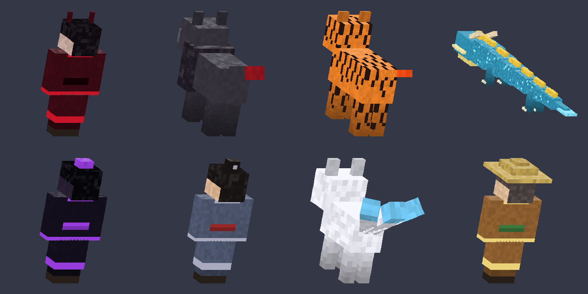
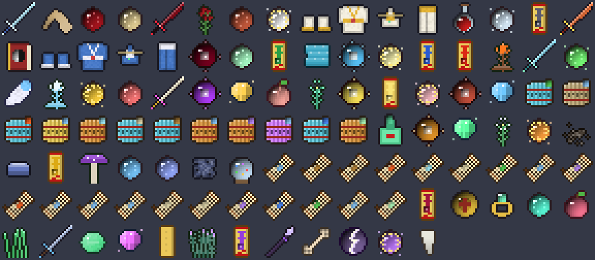
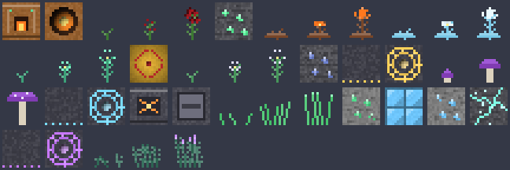

# Xianxia Cultivation: Minecraft Bedrock Add-on

A cultivation (修仙) overhaul for Minecraft Bedrock Edition. You start as a mortal and climb eleven realms to True Immortal. Along the way you deal with spirit roots, cultivation manuals, martial techniques, alchemy, artifact refining, formation arrays, talismans, sword flight, heavenly tribulations, heart demons, sects, karma, spirit beasts and beast tides.



## Install

1. Download **[`dist/Xianxia_Cultivation.mcaddon`](dist/Xianxia_Cultivation.mcaddon)** and open it. Minecraft imports both packs.
   (The separate `.mcpack` files in `dist/` work too.)
2. Create or edit a world and enable **both** packs: *Xianxia Cultivation (Behavior)* and *Xianxia Cultivation (Resources)*.
3. You don't need any experimental toggles. It requires **Minecraft Bedrock 1.21.90 or newer** (Script API `@minecraft/server` 2.0.0, `@minecraft/server-ui` 2.0.0).

Ores and herbs only generate in newly explored chunks.

## Getting started

When you first join you receive the **Cultivation Codex**, the **Martial Jade Seal**, a **Spirit Root Testing Stone**, a basic manual, a technique scroll, a few pills and some spirit stones.

1. Use the **Spirit Root Testing Stone** to find out how talented you are.
2. Read the **Jade Slip** to learn the *Basic Qi Breathing Technique*.
3. **Meditate**: sneak and stand still with an empty hand, use the Codex's *Meditate* button, or sit on a Meditation Cushion. Sensing qi takes you from Mortal into Qi Condensation.
4. Learn **Spirit Qi Bolt** from the scroll and cast it with the **Martial Jade Seal**. Sneak + use the seal to switch techniques.
5. At the peak of a realm you hit a bottleneck. Open the **Codex → Attempt Breakthrough**. From Core Formation onward you must survive heavenly tribulation lightning, and from Nascent Soul onward you must also kill your Heart Demon.

The Codex has an in-game **Dao Guide** that covers every system.

## Features

| System | What's in it |
|---|---|
| **Realms** | Mortal → Qi Condensation (9 layers) → Foundation Establishment → Core Formation → Nascent Soul → Soul Transformation → Void Refinement → Body Integration → Mahayana → Tribulation Transcendence → True Immortal. Each realm gives health, strength, resistance, speed, jump, regeneration, qi capacity and lifespan. |
| **Spirit roots** | Heavenly, Mutated (lightning/ice/wind), Dual, Triple, Quad and Pseudo roots, each with a cultivation multiplier and element affinities. Bone Marrow Cleansing Pills upgrade your root and can even mutate it. |
| **Meditation** | Cultivation speed is root × manual × environment. Environment bonuses come from Spirit Veins, Qi Gathering Arrays, a meditation cushion, the full moon, a spirit fox companion and your sect. Meditating also restores qi quickly. |
| **Manuals** | 12 jade-slip arts from Mortal to Heaven grade. Each has its own conditions: Blazing Sun is stronger at noon, Frost Moon at night and under a full moon, Nine Heavens Thunder in storms, Great Earth deep underground, and the demonic Heavenly Devouring art grows from kills. |
| **Body cultivation** | A second progression track (Copper Skin → Iron Bone → … → Immortal Primordial Body). You level it by taking damage, surviving tribulation lightning and eating Body Tempering Pills. |
| **Techniques** | 20 techniques: qi bolt, fireball, crescent sword qi, frost lotus, healing spring, divine sense (it also finds ores), vines, tidal palm, mountain stance, golden bell, thunder palm, phoenix inferno, Buddha palm, heavenly thunder, void step, ten-thousand swords, blood sacrifice, heavenly domain and starfall. Damage scales with realm and element compatibility. |
| **Breakthroughs** | Chance-based, modified by pills, Dao Comprehension, karma, sect and toxicity. Failing causes qi deviation and costs cultivation, but you gain insight. |
| **Tribulation** | Up to 18 waves of lightning plus a Heart Demon duel. You can reduce it with warding talismans, the Void Tribulation Pill or the Nine Heavens Thunder Art. |
| **Alchemy** | Alchemy Furnace with 16 pills. Alchemist grades 1–9 raise your success rate and yield. Pill toxicity builds up and Detox Pills clear it. |
| **Refining** | Artifact Refining Forge for spirit weapons with on-hit effects (frost, flame, thunder, lifesteal, heaven-severing), two robe armor sets, formation arrays, the Spatial Ring and the Dragon Pearl. |
| **Talismans** | Flame Burst, Five Thunder, Golden Light Protection, Divine Travel, Thousand-Mile Escape, Concealment, Immortal Binding Seal and Tribulation Warding. |
| **Formations** | Qi Gathering Array (faster cultivation and faster herb growth), Heaven Guarding Array (repels monsters) and Teleportation Arrays (named, networked, cost one spirit stone per jump). |
| **Treasures** | Flying Sword (Foundation Establishment and up), Spatial Storage Ring, Beast Tide Horn and Dragon Summoning Pearl. |
| **World** | Spirit stone ores (4 grades of stone), spirit jade, profound iron and rare Spirit Veins. 8 herbs grow wild by biome; you can replant them and bone meal them. |
| **Creatures** | Tameable Spirit Fox (three tails), Demonic Wolf packs, Flame-Striped Tiger (fire breath), Rogue and Demonic Cultivators (ranged qi/blood bolts), Wandering Pill Merchant (buys and sells), Heart Demon and the **Azure Flood Dragon** boss. |
| **Sects** | Four sects (righteous, neutral, demonic), each with a perk. Six ranks, a mission hall and a contribution treasury. |
| **Karma** | Killing innocents lowers karma. Slaying demonic cultivators raises it. Righteous sects expel demonic cultivators, and heavy karma makes tribulations harsher. |
| **Events** | Random night-time beast tides and server-wide announcements for breakthroughs and ascensions. |

The full tables for every realm, pill recipe, refining recipe, crafting recipe, herb biome, mob and merchant price are in **[docs/CONTENT.md](docs/CONTENT.md)**. That file is generated from the same data as the add-on.

Key crafting-table recipes: **Alchemy Furnace** (blast furnace, iron, copper, spirit stones) and **Refining Forge** (anvil, obsidian, iron, spirit stones). Talismans are shapeless: Blank Talisman Paper + Cinnabar Ink + a catalyst.

Creative-mode players get a **Creative Tools** page in the Codex for testing: set realm, give items, reroll root, add alchemy experience and so on. The world owner (the first player to join) can toggle PvP techniques and random beast tides in **Settings**.

## Art




Every texture, model and particle is **original and procedurally generated** by `tools/textures.py` and `tools/models.py`. The add-on contains no assets taken from other packs or games, so you're free to redistribute it.

## Building from source

```bash
pip install pillow
python3 tools/build.py        # regenerates packs/ and dist/ and docs/CONTENT.md
python3 tools/preview.py      # renders docs/previews/*.png
node tools/smoketest/run.mjs  # headless gameplay smoke test against mocked Minecraft APIs
```

- `tools/content.py` holds all game data (realms, pills, techniques, mobs, recipes…). Change numbers there and rebuild.
- `src/scripts/*.js` holds the Script API gameplay code. It is copied into the behavior pack, and `data.js` is generated next to it.
- `packs/` and `dist/` are build outputs, committed so you can install without building.

## How it was verified

The add-on has **not yet been play-tested in a real Minecraft client**. These are the automated checks it passes:

- All 271 pack JSON files validate against the community [Bedrock JSON schemas](https://github.com/Blockception/Minecraft-bedrock-json-schemas).
- The scripts type-check (`tsc --checkJs`) against the official `@minecraft/server` 2.0.0 and `@minecraft/server-ui` 2.0.0 typings.
- `tools/smoketest/run.mjs` loads the real scripts against mocked APIs. It drives meditation, breakthroughs, tribulation, the Heart Demon fight, all 20 techniques, every pill and talisman, sword flight, beast tides, sect missions, karma, the codex menus, the alchemy furnace and teleport arrays, with zero runtime errors.

Balance numbers (cultivation speed, tribulation damage, drop rates) are first-pass values. If you find something that doesn't load or feels off, `tools/content.py` is the place to tune it.
